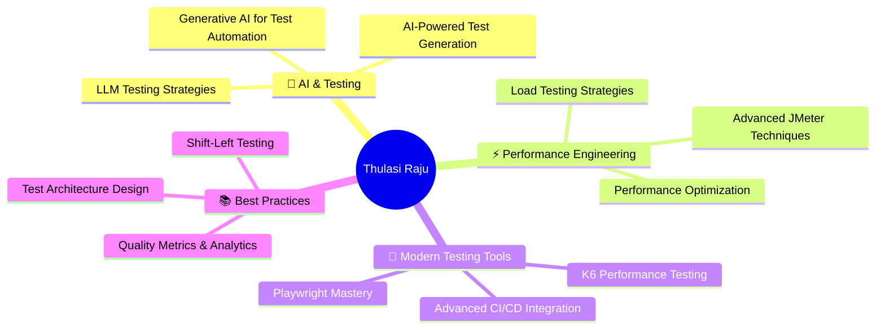

<div align="center">

# Hi there, I'm Thulasi Raju! 👋

[](https://git.io/typing-svg)


### 🚀 Passionate about Quality | Test Automation | Performance Engineering

</div>

---

## 🌟 About Me

```typescript
const thulasiraju = {
    role: "Software Engineer in Test",
    background: "Electronics & Communication Engineering",
    location: "India",
    expertise: ["Test Automation", "Quality Assurance", "Performance Testing"],
    currentFocus: ["Generative AI", "Advanced Performance Testing", "JMeter Mastery"],
    passion: "Building robust test frameworks and ensuring software reliability",
    funFact: "ECE graduate turned QA champion 🔬➡️💻"
};
```

## 📫 Connect With Me

<div align="center">

[](https://thulasiraju.vercel.app/)
[](https://www.linkedin.com/in/thulasi-raju-265b50b6/)
[](mailto:thulasirajua159@gmail.com)
[](https://twitter.com/yourhandle)

</div> 

## 🛠️ Tech Stack & Expertise

<details open>
<summary><b>💻 Programming Languages</b></summary>
<br>


</details>

<details open>
<summary><b>🧪 Testing & Automation Frameworks</b></summary>
<br>


</details>

<details open>
<summary><b>⚡ Performance & API Testing</b></summary>
<br>


</details>

<details open>
<summary><b>🚀 Frameworks & Backend</b></summary>
<br>


</details>

<details open>
<summary><b>🗄️ Databases</b></summary>
<br>


</details>

<details open>
<summary><b>☁️ DevOps & Cloud Platforms</b></summary>
<br>


</details>

<details open>
<summary><b>🔧 Tools & IDEs</b></summary>
<br>


</details>

## 📈 GitHub Stats & Achievements

<div align="center">

### 🔥 GitHub Streak

[](https://git.io/streak-stats)

### 📊 Contribution Stats


### 🏆 GitHub Trophies

[](https://github.com/ryo-ma/github-profile-trophy)

### 📊 Activity Graph

[](https://github.com/ashutosh00710/github-readme-activity-graph)

</div>

---

## 🚀 Featured Projects & Work

<div align="center">

### 🔍 Explore My Repositories

I'm passionate about building quality test frameworks and automation solutions. Check out my pinned repositories below to see what I'm working on!

<!-- Uncomment and add your notable projects here:

<table>
  <tr>
    <td width="50%">
      <h3 align="center">Project Name</h3>
      <div align="center">
        <a href="https://github.com/thulasiraju/project-name" target="_blank">
          
        </a>
        <p><strong>Tech Stack:</strong> Python, Selenium, pytest</p>
        <p>Brief description of what the project does and its key features.</p>
      </div>
    </td>
    <td width="50%">
      <h3 align="center">Project Name 2</h3>
      <div align="center">
        <a href="https://github.com/thulasiraju/project-name-2" target="_blank">
          
        </a>
        <p><strong>Tech Stack:</strong> JavaScript, Playwright, Node.js</p>
        <p>Brief description of what the project does and its key features.</p>
      </div>
    </td>
  </tr>
</table>

-->

</div>

---

## 🌱 Current Focus & Learning

<div align="center">



</div>

---

## 💼 Professional Highlights

<table>
  <tr>
    <td align="center" width="33%">
      
      <br><strong>Quality Assurance</strong>
      <br>Expert in building comprehensive QA strategies
    </td>
    <td align="center" width="33%">
      
      <br><strong>Test Automation</strong>
      <br>Specialized in scalable automation frameworks
    </td>
    <td align="center" width="33%">
      
      <br><strong>Performance Testing</strong>
      <br>Focused on performance optimization
    </td>
  </tr>
</table>

---

## 🐍 Contribution Snake

<div align="center">


</div>

---

## 💬 Let's Connect & Collaborate

<div align="center">

I'm always excited to collaborate on innovative projects, discuss testing strategies, or share knowledge about quality engineering!

**Feel free to reach out:**

[](https://www.linkedin.com/in/thulasi-raju-265b50b6/)
[](mailto:thulasirajua159@gmail.com)
[](https://thulasiraju.vercel.app/)

### 💡 Open to:
✅ Consulting opportunities
✅ Speaking engagements
✅ Open source collaborations
✅ Knowledge sharing sessions

</div>

---

<div align="center">

### ⚡ Fun Fact

*From Electronics & Communication Engineering to Software Quality Engineering*
**Proving that the best debuggers come from unexpected backgrounds!** 🔬 ➡️ 💻

---

### 🌟 Show Some Love

If you find my work interesting or helpful, consider giving a ⭐ to my repositories!

---


**⭐️ From [Thulasi Raju](https://github.com/thulasiraju) with 💙**

</div>