<div align="center">

# Hi there, I'm Thulasi Raju! 👋

[](https://git.io/typing-svg)


### 🚀 Passionate about Quality | Test Automation | Performance Engineering

</div>

---

<div align="center">

## 🌟 About Me

</div>

```typescript
const thulasiraju = {
    role: "Quality Assurance Engineer (Test Engineer III)",
    company: "Johnson Controls India Pvt Ltd",
    experience: "8+ years",
    background: "B.Tech in Electronics & Communication Engineering",
    location: "Bangalore, India",

    expertise: [
        "Test Automation (6+ years)",
        "Performance Testing & Engineering",
        "Microservices Testing",
        "Cloud Technologies (GCP - 4+ years)"
    ],

    specializations: {
        automation: ["Python", "pytest", "Selenium", "Playwright", "Robot Framework"],
        performance: ["JMeter", "Service Level Profiling", "Synthetic Testing"],
        cloud: ["GCP (BigQuery, Dataflow, Kubernetes, Pub/Sub)", "Observability Tools"],
        leadership: ["Framework Architecture", "Team Mentoring", "Cross-functional Collaboration"]
    },

    currentFocus: [
        "Generative AI for Test Automation",
        "Advanced Performance Engineering",
        "Cloud-Native Testing Solutions"
    ],

    achievements: [
        "Reduced observability costs by 50% through custom synthetic testing framework",
        "Achieved 95% API coverage across microservices",
        "Cut post-release defects by 30% through comprehensive automation",
        "Reduced new script onboarding time by 40% with modular framework design"
    ],

    passion: "Architecting scalable test frameworks and driving quality excellence",
    funFact: "ECE graduate turned QA champion 🔬➡️💻"
};
```

---

<div align="center">

## 📫 Connect With Me

[](https://thulasiraju.vercel.app/)
[](https://www.linkedin.com/in/thulasi-raju-265b50b6/)
[](mailto:thulasirajua159@gmail.com)
[](https://twitter.com/yourhandle)

</div>

---

<div align="center">

## 🛠️ Tech Stack & Expertise

</div>

<details open>
<summary><b>💻 Programming Languages</b></summary>
<br>


</details>

<details open>
<summary><b>🧪 Testing & Automation Frameworks</b></summary>
<br>


</details>

<details open>
<summary><b>⚡ Performance & API Testing</b></summary>
<br>


</details>

<details open>
<summary><b>☁️ Cloud Platforms & Services</b></summary>
<br>


</details>

<details open>
<summary><b>📊 Observability & Monitoring</b></summary>
<br>


</details>

<details open>
<summary><b>🚀 CI/CD & DevOps Tools</b></summary>
<br>


</details>

<details open>
<summary><b>🗄️ Databases</b></summary>
<br>


</details>

<details open>
<summary><b>🔧 Tools & IDEs</b></summary>
<br>


</details>

---

<div align="center">

## 📈 GitHub Stats & Achievements

</div>

<div align="center">

### 🔥 GitHub Streak

[](https://git.io/streak-stats)

### 📊 Contribution Stats


### 🏆 GitHub Trophies

[](https://github.com/ryo-ma/github-profile-trophy)

### 📊 Activity Graph

[](https://github.com/ashutosh00710/github-readme-activity-graph)

</div>

---

<div align="center">

## 💼 Professional Experience Highlights

</div>

<table>
<tr>
<td align="center" width="50%">

### 🏢 Johnson Controls India
**Test Engineer III** | *Apr 2022 - Present*

**Key Projects:**
- **Shrink Analyzer Platform**
  - Architected scalable test automation framework
  - Achieved 95% API coverage across microservices
  - Reduced observability costs by 50%
  - Built synthetic testing with Playwright

</td>
<td align="center" width="50%">

### ⚡ Schneider Electric India
**Automation Test Engineer** | *Jun 2018 - Mar 2022*

**Key Projects:**
- **NetBotz Rack Monitoring**
  - Developed UI automation with Selenium & Java
  - Implemented API testing (REST/SOAP)
  - Created CI/CD pipelines with Jenkins
  - SNMP trap validation & testing

</td>
</tr>
</table>

---

<div align="center">

## 🚀 Featured Projects & Work

### 🔍 Explore My Repositories

*I'm passionate about building quality test frameworks and automation solutions. Check out my pinned repositories below to see what I'm working on!*

<!-- Uncomment and add your notable projects here:

<table>
  <tr>
    <td width="50%">
      <h3 align="center">Project Name</h3>
      <div align="center">
        <a href="https://github.com/thulasiraju/project-name" target="_blank">
          
        </a>
        <p><strong>Tech Stack:</strong> Python, Selenium, pytest</p>
        <p>Brief description of what the project does and its key features.</p>
      </div>
    </td>
    <td width="50%">
      <h3 align="center">Project Name 2</h3>
      <div align="center">
        <a href="https://github.com/thulasiraju/project-name-2" target="_blank">
          
        </a>
        <p><strong>Tech Stack:</strong> JavaScript, Playwright, Node.js</p>
        <p>Brief description of what the project does and its key features.</p>
      </div>
    </td>
  </tr>
</table>

-->

</div>

---

<div align="center">

## 🌱 Current Focus & Learning

```mermaid
flowchart TD
    A[🎯 Professional Development Goals] --> B[🤖 AI & Testing]
    A --> C[⚡ Performance Engineering]
    A --> D[🔧 Modern Testing Tools]
    A --> E[📚 Best Practices]

    B --> B1[Generative AI for Test Automation]
    B --> B2[AI-Powered Test Generation]
    B --> B3[LLM Testing Strategies]

    C --> C1[Advanced JMeter Techniques]
    C --> C2[Load Testing Strategies]
    C --> C3[Microservices Performance Testing]

    D --> D1[Playwright Mastery]
    D --> D2[K6 Performance Testing]
    D --> D3[Advanced CI/CD Integration]

    E --> E1[Test Architecture Design]
    E --> E2[Quality Metrics & Analytics]
    E --> E3[Shift-Left Testing]

    style A fill:#e05397,stroke:#fff,stroke-width:2px,color:#fff
    style B fill:#36BCF7,stroke:#fff,stroke-width:2px,color:#fff
    style C fill:#36BCF7,stroke:#fff,stroke-width:2px,color:#fff
    style D fill:#36BCF7,stroke:#fff,stroke-width:2px,color:#fff
    style E fill:#36BCF7,stroke:#fff,stroke-width:2px,color:#fff
```

</div>



---

<div align="center">

## 💡 Core Competencies

</div>

<table align="center">
  <tr>
    <td align="center" width="33%">
      
      <br><br><strong>Quality Assurance Leadership</strong>
      <br><br>8+ years driving comprehensive QA strategies
      <br>Leading cross-functional automation initiatives
      <br>Mentoring teams on best practices
    </td>
    <td align="center" width="33%">
      
      <br><br><strong>Test Automation Excellence</strong>
      <br><br>6+ years architecting scalable frameworks
      <br>Expertise in Python, pytest, Selenium, Playwright
      <br>40% reduction in onboarding time
    </td>
    <td align="center" width="33%">
      
      <br><br><strong>Performance Engineering</strong>
      <br><br>Service-level profiling & capacity analysis
      <br>Synthetic testing & observability
      <br>50% cost reduction achieved
    </td>
  </tr>
</table>

---

<div align="center">

## 🐍 Contribution Activity


</div>

---

<div align="center">

## 💬 Let's Connect & Collaborate

*I'm always excited to collaborate on innovative projects, discuss testing strategies, or share knowledge about quality engineering!*

**Feel free to reach out:**

[](https://www.linkedin.com/in/thulasi-raju-265b50b6/)
[](mailto:thulasirajua159@gmail.com)
[](https://thulasiraju.vercel.app/)

### 💡 Open to:

✅ Lead/Senior QA Engineer opportunities
✅ Consulting engagements
✅ Speaking engagements & knowledge sharing
✅ Open source collaborations
✅ Technical mentoring & coaching

</div>

---

<div align="center">

### ⚡ Fun Fact

*From Electronics & Communication Engineering to Software Quality Engineering*
**Proving that the best debuggers come from unexpected backgrounds!** 🔬 ➡️ 💻

---

### 🌟 Show Some Love

*If you find my work interesting or helpful, consider giving a ⭐ to my repositories!*

---


**⭐️ From [Thulasi Raju](https://github.com/thulasiraju) with 💙**

</div>
